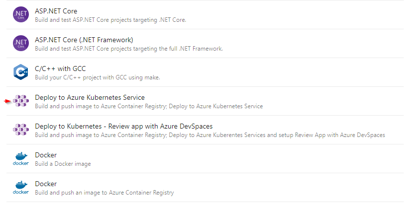
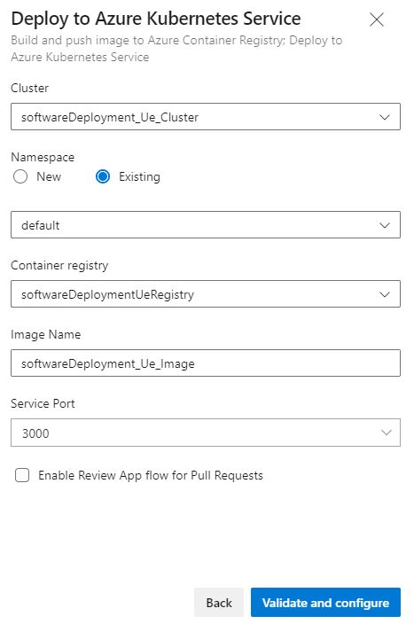
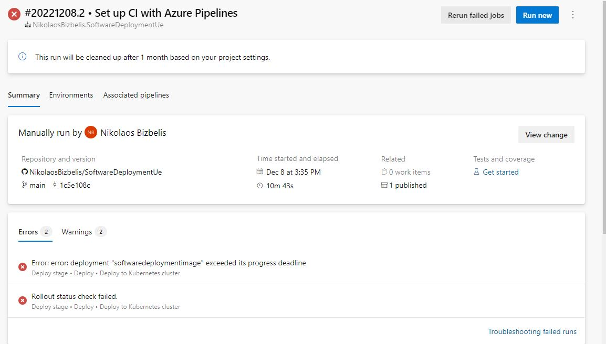

# Software Deployment Lab5

A containerized DevOps pipeline that deploys a [Node.js application](http://20.31.196.204:3000/) to AKS.

* [Project source files](https://github.com/NikolaosBizbelis/SoftwareDeploymentUe)

* [Web-App](http://20.31.196.204:3000/)

* [Docker image in the registry](https://softwaredeploymentueregistry.azurecr.io/softwaredeploymentimage)

## Setup
If there is a choice, then make sure to always choose the cheapest option available!

1. Create Kubernetes Service (in [Azure Portal](https://portal.azure.com/#home))

2. Create Container Registry (in [Azure Portal](https://portal.azure.com/#home))

3. [Attach your ACR to your AKS](https://learn.microsoft.com/en-us/azure/aks/cluster-container-registry-integration?tabs=azure-cli) by running following command after logging in through your terminal:
```
az aks update -n myAKSCluster -g myResourceGroup --attach-acr <acr-name>
```

4. Create the pipeline (in [Azure DevOps](https://dev.azure.com/)) as follows:
	1. Go to your Azure DevOps Project
	2. Select Pipeline - Pipelines - Create New
		1. Connect: "GitHub (Yaml)"
		2. Select: Select your repository
		3. Configure:
		
		
		

The repository will now have a few files added to it:
- azure-pipelines.yml
- manifests/deployment.yml
- manifests/service.yml

Now you simply need to add your (node) app as well as the dockerfile and you're set.

After each commit the pipeline will now be automatically run.

## Encountered problems
There were a couple of problems that had to be fixed before everything ran smoothly. These problems were fixed by first getting information on what went wrong through following commands:
```
kubectl get pods
kubectl describe pods/<podName>
```

### PROBLEM: Error: error deployment exceeded its progress deadline and subsequent Rollout status check failed.
#### Problem

The pipeline failed after ~10 minutes. A normal amount of time to run for our small pipeline is 1-3 minutes.

#### Troubleshooting
Following commands were run with following results:
```
> kubectl get pods
NAME                                       READY   STATUS             RESTARTS   AGE
softwaredeploymentimage-6dc46ffbbd-5sdzb   0/1     ImagePullBackOff   0          33m

> kubectl describe pods/softwaredeploymentimage-6dc46ffbbd-5sdzb
[...]
Events:
  Type     Reason     Age                    From               Message
  ----     ------     ----                   ----               -------
  Normal   Scheduled  34m                    default-scheduler  Successfully assigned default/softwaredeploymentimage-6dc46ffbbd-5sdzb to aks-agentpool-55187176-vmss000000
  Normal   Pulling    32m (x4 over 34m)      kubelet            Pulling image "softwaredeploymentueregistry.azurecr.io/softwaredeploymentimage:1"
  Warning  Failed     32m (x4 over 34m)      kubelet            Failed to pull image "softwaredeploymentueregistry.azurecr.io/softwaredeploymentimage:1": [rpc error: code = NotFound desc = failed to pull and unpack image "softwaredeploymentueregistry.azurecr.io/softwaredeploymentimage:1": failed to resolve reference "softwaredeploymentueregistry.azurecr.io/softwaredeploymentimage:1": softwaredeploymentueregistry.azurecr.io/softwaredeploymentimage:1: not found, rpc error: code = Unknown desc = failed to pull and unpack image "softwaredeploymentueregistry.azurecr.io/softwaredeploymentimage:1": failed to resolve reference "softwaredeploymentueregistry.azurecr.io/softwaredeploymentimage:1": failed to authorize: failed to fetch anonymous token: unexpected status: 401 Unauthorized]
  Warning  Failed     32m (x4 over 34m)      kubelet            Error: ErrImagePull
  Warning  Failed     32m (x6 over 34m)      kubelet            Error: ImagePullBackOff
  Normal   BackOff    3m57s (x132 over 34m)  kubelet            Back-off pulling image "softwaredeploymentueregistry.azurecr.io/softwaredeploymentimage:1"
```

#### Solution
The problem was a missing dockerfile. After actually adding a dockerfile it worked.

### PROBLEM: Status: CrashLoopBackOff
#### Problem
Pipeline ran without problems, but site was unavailable.

#### Troubleshooting
Following commands were run with following results:
```
> kubectl get pods
NAME                                       READY   STATUS             RESTARTS     AGE
softwaredeploymentimage-67696596df-4jpt8   0/1     CrashLoopBackOff   4 (64s ago)  36m
```

#### Solution
The dockerfile was incompatible with the app. Fixing the dockerfile fixed this problem

### PROBLEM: Site is unavailable
#### Problem
Pipeline ran without problems, but site was unavailable. Furthermore the troubleshooting commands returned results that were indicative of everything running correctly.

#### Troubleshooting
The root cause was unable to be found until we took a look into the dockerfile.

#### Solution
The dockerfile had a different port exposed than the .yml-files. Fixing the .yml-files fixed this problem.

## Architectural decisions
* [Azure Container Registry](https://azure.microsoft.com/en-us/products/container-registry/) was chosen as the registry to store the image in because it easily integrates with the existing deployment structure.
* A simple Node.js express app was created to demonstrate, because of its simplicity.

## Helpful links:
* [How-To deploy Docker images to Azure Kubernetes Services (AKS)](https://purple.telstra.com.au/blog/how-to-deploy-docker-images-to-azure-kubernetes-services-aks)
* [Dockerizing a Node.js web app](https://nodejs.org/en/docs/guides/nodejs-docker-webapp/)
* [Build and push Docker images to Azure Container Registry](https://learn.microsoft.com/en-us/azure/devops/pipelines/ecosystems/containers/acr-template?view=azure-devops)
* [Build and deploy to Azure Kubernetes Service with Azure Pipelines](https://learn.microsoft.com/en-us/azure/aks/devops-pipeline?pivots=pipelines-yaml)


